# SMTP Mail Server - Complete Network Architecture

## Network-Level Architecture Diagram

## Data Flow Diagrams

### 1. Incoming Mail Flow (External to Server)

### 2. Outgoing Mail Flow (API to SendGrid to External)

### 3. SMTP Authentication Flow

```mermaid
sequenceDiagram
    participant Client as Email Client
    participant SMTP as SMTP Server
    participant Auth as Auth Service
    participant User as User Service
    participant DB as MongoDB
    
    Client->>SMTP: Connect to port 2525
    SMTP-->>Client: 220 ESMTP ready
    Client->>SMTP: EHLO client.example.com
    SMTP-->>Client: 250-AUTH PLAIN LOGIN
    Client->>SMTP: AUTH PLAIN <base64>
    SMTP->>SMTP: Extract username/password
    SMTP->>Auth: authenticateSMTP(username, password)
    Auth->>User: findUserByEmail(username)
    User->>DB: Query Users collection
    DB-->>User: User document
    User-->>Auth: User found
    Auth->>User: verifyPassword(user, password)
    User->>DB: Compare password hash
    DB-->>User: Password valid
    User-->>Auth: Authentication successful
    Auth-->>SMTP: User authenticated
    SMTP-->>Client: 235 Authentication successful
```

### 4. Domain Verification Flow

## Component Interaction Architecture

## Network Topology

## DNS & Email Routing Architecture

## Database Schema Relationships

This comprehensive architecture diagram shows:
- **Network layer**: DNS, routing, firewall
- **Application layer**: API server, SMTP server
- **Service layer**: Business logic services
- **Data layer**: MongoDB and Azure Blob Storage
- **External integrations**: SendGrid, DNS servers
- **Client interactions**: Web clients, email clients
- **Process management**: PM2 daemon
- **Security**: SSL/TLS, authentication flows

